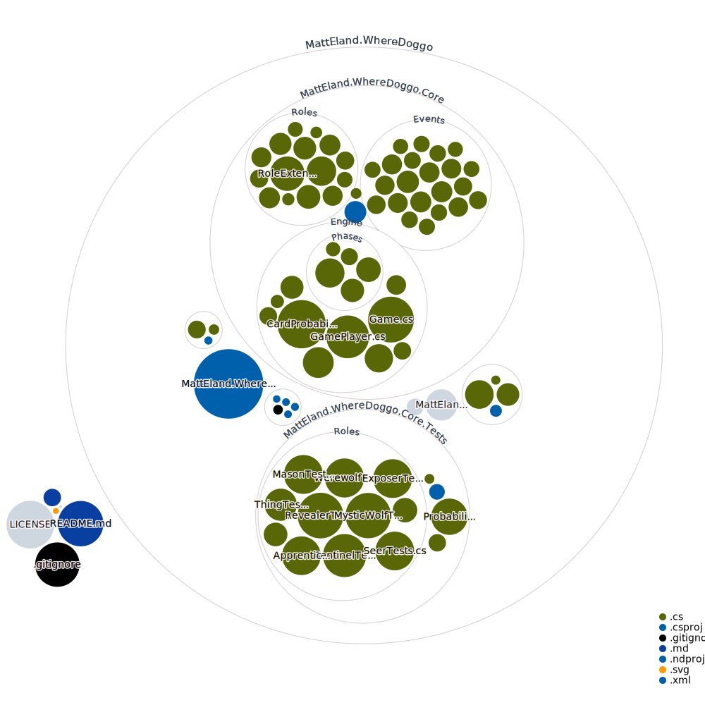

# Where Doggo

This project is an AI simulation of a variant of the popular One Night Ultimate Werewolf games by [Bezier Games](https://beziergames.com/).

One Night Ultimate Werewolf is copyright by Bezier Games Inc. 
This project is a non-commercial work intended for AI research only.

The purpose of this project is to try to build AI bots that can make reasoned deductions in a social deduction type of game and decieve each other and potentially even human players.

## Current Features

### Modes

Only one mode is supported at the moment: an AI vs AI mode in a .NET Console app.

Down the road I hope to add a desktop and browser version of the application as well as the ability for a human player to play against AI agents.

### Supported Roles

Currently partial or complete support for the following roles is implemented:

- Werewolf
- Villager
- Insomniac
- Sentinel
- Apprentice Seer
- Mason
- Revealer
- Exposer

### Supported Capabilities

Players currently build a probabilistic model of what every card in the game might be given their knowledge and the set of cards in the deck.

At the end of the round, each player randomly votes for one of the cards they believe are most likely to be a werewolf

## High Level Approach

This section will be greatly expanded in the future as the engine's capabilities evolve.

For now, the system uses an _event-based_ approach to build a _probabilistic model_ of where each card in play might be.

### Probabilistic Modeling

Each agent has their own unique probabilistic model of what every card in the game might be (including their own). Various observed events can impact the information known or believed about each card, which helps players narrow down who they should vote for as well as what team they wound up on (once roles that move cards are part of the simulation in phase 3).

### Event-Based System

Everything that happens in the game is represented as an event, from players looking at their initial roles to werewolves waking up, to the insomniac looking at her card, to players claiming roles or voting.

Not all players see every event, so each player has their own internally known set of events.

The set of known events is used to build the probabilistic model of what each card contains.

In the future, AIs will be able to consider events they didn't witness directly into their reasoning, as we add in support for moving cards in Phase 3.

## Roadmap

### Phase 1 - Basic Roles

Phase 1 focuses on the roles that do not involve swapping cards around. The focus for this 

Planned roles in Phase 1 are:

- [x] Werewolves
- [x] Villager
- [x] Insomniac*
- [x] Sentinel*
- [x] Apprentice Seer
- [x] Masons
- [x] Revealer
- [x] Exposer
- [ ] Mystic Wolf
- [ ] The Thing
- [ ] Seer

_Note: the **Insomniac** and **Sentinel** roles don't make complete sense until paired with card moving abilities and will be expanded as features grow, but adding them early helped establish baseline AI deductive capabilities_

Planned features in Phase 1 are:

- [x] Night Phase
- [x] Day Phase
- [x] Probabilistic model of what cards are at play start
- [x] Simple voting
- [ ] Claiming Roles
- [ ] Wolves Falsely Claiming Roles (most probable center card given existing claims)
- [ ] Suspecting fake claims
- [ ] Seer / Apprentice Seer Claims share what card they viewed
- [ ] Voting in a Circle (if thinking no werewolves present)
- [ ] Random Game Generator

### Phase 2 - Added Duplicity

This phase focuses on additional roles that want to be detected / voted.

Planned roles:

- [ ] Hunter
- [ ] Minion
- [ ] Bodyguard
- [ ] Tanner
- [ ] Mortician
- [ ] Prince

Planned features:

- [ ] Players sharing their suspicions
- [ ] Voting factoring in suspicions of others
- [ ] Tanner AI
- [ ] Minion AI
- [ ] Mortician Randomness

### Phase 3 - Complex Roles

This phase focuses on additional roles that want to be detected / voted.

Planned roles:

- [ ] Beholder*
- [ ] Squire*
- [ ] Apprentice Tanner
- [ ] Paranormal Investigator
- [ ] Psychic
- [ ] Blob
- [ ] Aura Seer
- [ ] Cursed

_Note: the **beholder**, and **squire** roles don't make complete sense until paired with card moving abilities and will be expanded as features grow, but adding them early helped establish baseline AI deductive capabilities_

Planned features:

- [ ] Windows Client

### Phase 4 - Wolves-Only Card Moving

Planned roles:

- [ ] Alpha Wolf
- [ ] Dream Wolf

Planned features:

- [ ] Phase by phase probabilistic model of the board
- [ ] AI Agents attempt to determine which team they're on
- [ ] Ex-apprentice tanner will identify old tanner

### Phase 5 - Card Moving

Planned roles:

- [ ] Robber
- [ ] Troublemaker
- [ ] Witch
- [ ] Alpha Wolf
- [ ] Dream Wolf
- [ ] Drunk
- [ ] Village Idiot
- [ ] Rascal

Planned features:

- [ ] Phase by phase probabilistic model of the board
- [ ] AI Agents attempt to determine which team they're on
- [ ] Ex-wolves will identify old partners when claiming
- [ ] Ex-apprentice tanner will identify old tanner
- [ ] Dream wolf special slot
- [ ] Witch will sometimes take dream wolf card
- [ ] Drunk will sometimes take dream wolf card

### Roles not currently Roadmapped

- Mark-Related Roles
	- Vampire
	- Pickpocket
	- Gremlin
	- Priest
	- Marksman
	- Copycat
	- The Count
	- Cupid
	- Diseased
	- Renfield
	- The Master
	- Investigator
	- Assassin
	- Apprentice Assassin
- Alien-Related Roles
	- Alien
	- Synthetic Alien
	- Zerb (Alien)
	- Groob (Alien)
	- Cow
	- Leader
	- Body Snatcher
	- Nostradamus
- Misc. Roles
	- Doppleganger 
	- Oracle
	- Empath

## Technology

This application is built in C# on .NET 6 in Visual Studio 2022 and JetBrains Rider, but the core architecture is part of a class library and should be portable to other versions of .NET.

Unit testing is performed in [NUnit](https://nunit.org/) with [Shouldly](https://docs.shouldly.io/) assertions.