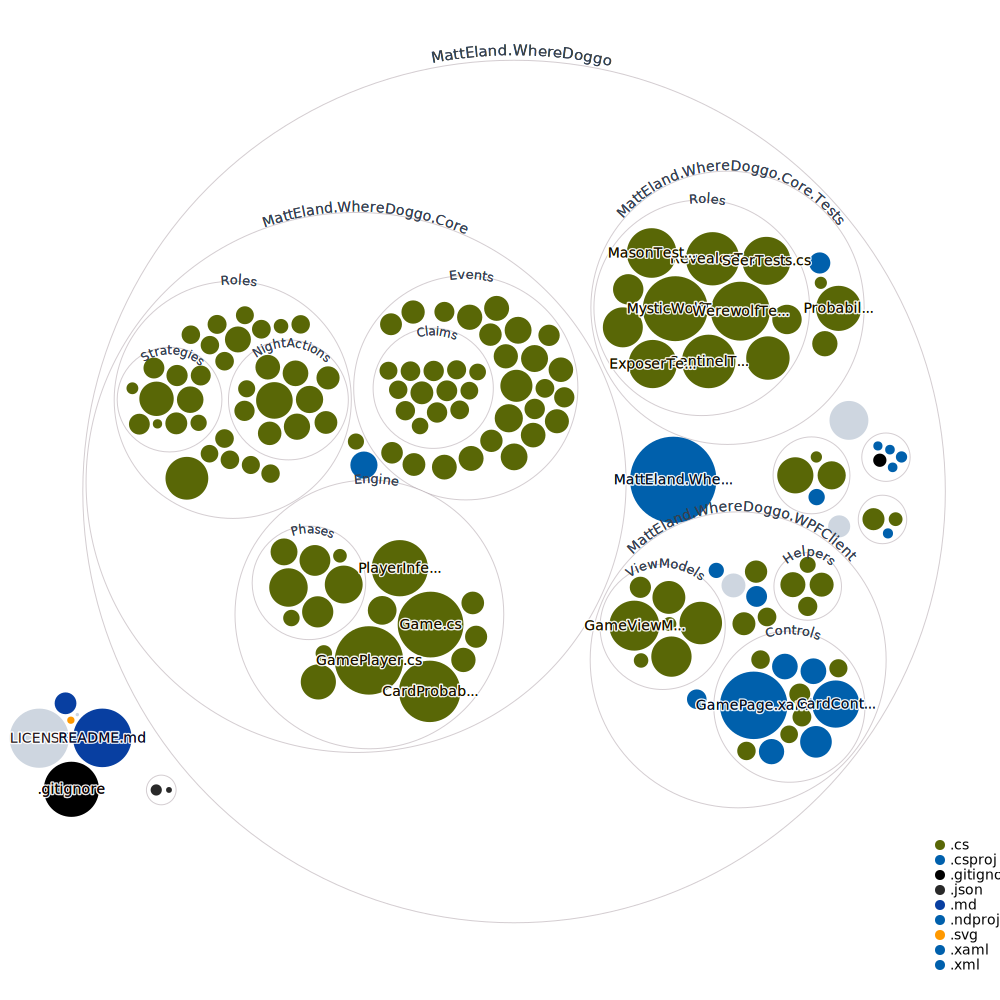

# Where Doggo

This project is an AI simulation of a variant of the popular One Night Ultimate Werewolf games by [Bezier Games](https://beziergames.com/).

One Night Ultimate Werewolf is copyright by Bezier Games Inc. This project is a non-commercial work intended for AI research only.

The purpose of this project is to try to build AI bots that can make reasoned deductions in a social deduction type of game and decieve each other and potentially even human players.

## Current Features

### Modes

Only one mode is supported at the moment: an AI vs AI mode in a .NET Console app.

Down the road I hope to add a desktop and browser version of the application as well as the ability for a human player to play against AI agents.

### Supported Roles

Currently partial or complete support for the following roles is implemented:

- Werewolf
- Villager
- Insomniac

### Supported Capabilities

Players currently build a probabilistic model of what every card in the game might be given their knowledge and the set of cards in the deck.

At the end of the round, each player randomly votes for one of the cards they believe are most likely to be a werewolf

## Roadmap

### Phase 1 - Basic Roles

Phase 1 focuses on the roles that do not involve swapping cards around. The focus for this 

Planned roles in Phase 1 are:

- [x] Werewolves
- [x] Villager
- [x] Insomniac
- [ ] Masons
- [ ] Apprentice Seer
- [ ] Mystic Wolf
- [ ] Revealer
- [ ] Exposer
- [ ] Seer
- [ ] Sentinel

Planned features in Phase 1 are:

- [x] Night Phase
- [x] Day Phase
- [x] Probabilistic model of what cards are at play start
- [x] Simple voting
- [ ] Claiming Roles
- [ ] Wolves Falsely Claiming Roles
- [ ] Players sharing their suspicions
- [ ] Voting factoring in suspicions of others
- [ ] Voting in a Circle (if thinking no werewolves present)
- [ ] Seer / Apprentice Seer Claims share what card they viewed
- [ ] Suspecting fake claims

### Phase 2 - Added Duplicity

This phase focuses on additional roles that want to be detected / voted.

Planned roles:

- [ ] Hunter
- [ ] Minion
- [ ] Bodyguard
- [ ] Tanner
- [ ] Apprentice Tanner
- [ ] Mortitian

Planned features:

- [ ] Tanner AI
- [ ] Mortitian Randomness
- [ ] Windows Client

### Phase 3 - Card Moving

Planned roles:

- [ ] Robber
- [ ] Troublemaker
- [ ] Witch
- [ ] Drunk
- [ ] Alpha Wolf
- [ ] Dream Wolf

Planned features:

- [ ] Phase by phase probabilistic model of the board
- [ ] AI Agents attempt to determine which team they're on
- [ ] Ex-wolves will identify old partners when claiming
- [ ] Ex-apprentice tanner will identify old tanner
- [ ] Dream wolf special slot
- [ ] Witch will sometimes take dream wolf card
- [ ] Drunk will sometimes take dream wolf card

## Code Architecture

Details coming as the development phase stabilizes, but here's a cloud of the various files:

